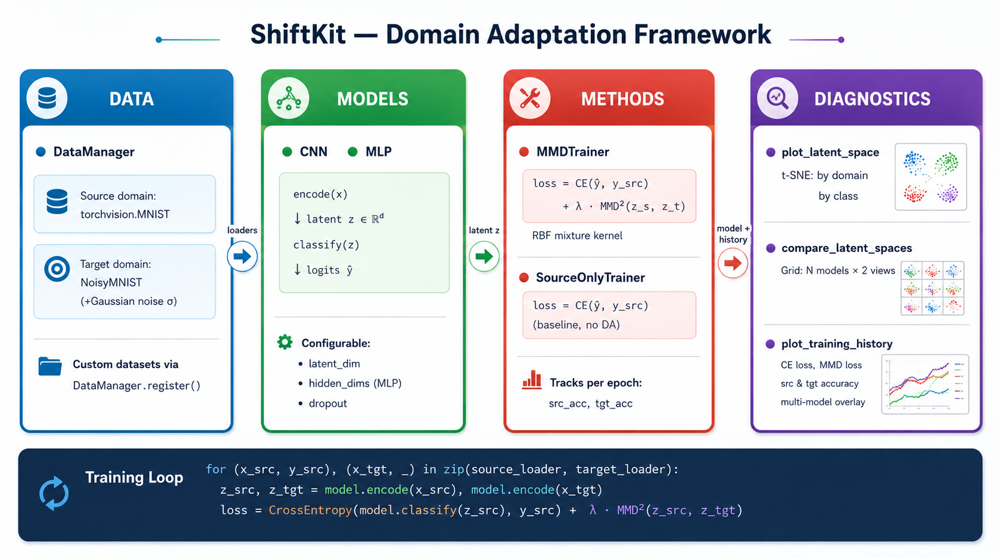

<p align="center">
  
</p>

A lightweight, modular **domain adaptation** framework for PyTorch. Transfer knowledge from a labelled *source* domain to an unlabelled *target* domain using deep latent-space alignment. Check out the full [Documentation](https://alekscipri.github.io/ShiftKit/).

## Overview



## Framework structure

```
shiftkit/
├── data/
│   └── datasets.py          # DataManager + NoisyMNIST + SyntheticGraphDataset
├── models/
│   ├── networks.py          # MLP, CNN  (encode / classify / regress split)
│   └── gnn.py               # SimpleGCN for graph-level tasks
├── methods/
│   ├── base.py              # BaseTrainer + TrainerRegistry
│   ├── mmd.py               # MMDLoss, MMDTrainer, SourceOnlyTrainer
│   ├── lmmd.py              # LMMDLoss, LMMDTrainer (class-conditional MMD)
│   ├── coral.py             # CORALLoss, CORALTrainer
│   ├── dann.py              # DANNTrainer, GradientReversalLayer
│   ├── sidda.py             # SIDDATrainer (Sinkhorn + dynamic regularisation)
│   ├── kliep.py             # KLIEPWeightEstimator, KLIEPTrainer
│   └── regression.py        # SourceOnlyRegressionTrainer, MMDRegressionTrainer
└── diagnostics/
    └── plots.py             # plot_latent_space, compare_latent_spaces, plot_training_history
examples/
├── mnist_mmd.py             # MMD vs source-only on MNIST → NoisyMNIST
└── mnist_mmd_lmmd.py        # LMMD comparison example
```

## Included methods

| Key | Method | Alignment strategy |
|-----|--------|--------------------|
| `source_only` | Source-Only baseline | none |
| `mmd` | MMD | distribution matching via RBF kernel mixture |
| `lmmd` | Local MMD | class-conditional distribution matching |
| `coral` | Deep CORAL | covariance matrix alignment (Frobenius norm) |
| `dann` | DANN | adversarial domain discriminator + gradient reversal |
| `sidda` | SIDDA | Sinkhorn divergence + dynamic regularisation + learnable loss weighting |
| `kliep` | KLIEP | instance-based importance weighting (density ratio estimation) |
| `mmd_regression` | MMD Regression | MMD alignment for regression tasks |

All methods share the same `BaseTrainer` interface and are accessible via `TrainerRegistry`.

## How each module works

**Data** — `shiftkit/data/datasets.py`
- `DataManager.load("mnist_noisy_mnist")` returns `(source_loader, target_loader)`
- Register custom dataset pairs via `DataManager.register(name, factory_fn)`
- Built-in: `NoisyMNIST` (MNIST + Gaussian noise) and `SyntheticGraphDataset`

**Models** — `shiftkit/models/`
- `MLP` and `CNN` expose `.encode(x)` → latent vector and `.classify(z)` → logits
- `SimpleGCN` for graph-level binary classification (no external graph library required)
- The encode/classify split lets any DA method operate in the latent space

**Methods** — `shiftkit/methods/`
- All trainers subclass `BaseTrainer` and record per-epoch history (`src_acc`, `tgt_acc`, losses)
- `TrainerRegistry` maps string keys to trainer classes — register your own with `@TrainerRegistry.register("my_method")`
- Regression variants track `src_rmse` / `tgt_rmse` instead of accuracy

**Diagnostics** — `shiftkit/diagnostics/plots.py`
- `plot_latent_space`: t-SNE → two panels (by domain / by class label)
- `compare_latent_spaces`: side-by-side grid comparing N models × 2 views
- `plot_training_history`: CE loss + source & target accuracy, supports multi-model overlay

## Quick start

```bash
git clone https://github.com/AleksCipri/ShiftKit.git
cd ShiftKit
pip install -r requirements.txt
python examples/mnist_mmd.py
```

To swap methods, use the registry:

```python
from shiftkit.methods import TrainerRegistry

trainer = TrainerRegistry.build("coral", model=model, src_loader=src, tgt_loader=tgt)
history = trainer.fit(epochs=20)
```

Outputs are saved to `./outputs/`:
- `training_history.png` — loss and accuracy curves
- `latent_space_comparison.png` — t-SNE grid comparing models
