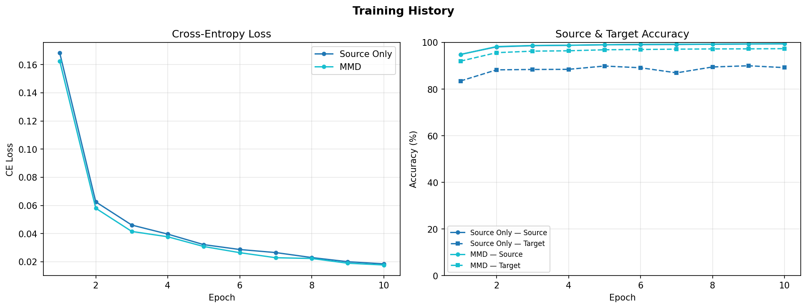

# Diagnostics

`shiftkit.diagnostics` provides visualisation tools for inspecting latent spaces and training dynamics.

---

## plot_latent_space

Encode samples from source and target loaders, project to 2-D with t-SNE, and plot two panels:

- **Left** — coloured by domain (source = blue, target = orange)
- **Right** — coloured by class label (10 colours)

```python
from shiftkit.diagnostics import plot_latent_space

fig = plot_latent_space(
    model=model,
    source_loader=test_src,
    target_loader=test_tgt,
    max_samples=2000,
    title="CNN + MMD (noise_std=0.3, λ=1.0)",
    save_path="outputs/latent_space.png",
    show=False,
)
```

### Parameters

| Parameter | Type | Default | Description |
|-----------|------|---------|-------------|
| `model` | `nn.Module` | — | Trained model with `.encode()` method |
| `source_loader` | `DataLoader` | — | Source domain DataLoader |
| `target_loader` | `DataLoader` | — | Target domain DataLoader |
| `max_samples` | `int` | `2000` | Max samples per domain (keeps t-SNE tractable) |
| `tsne_perplexity` | `float` | `30.0` | t-SNE perplexity |
| `tsne_n_iter` | `int` | `1000` | t-SNE number of iterations |
| `title` | `str` | `"Latent Space"` | Figure suptitle |
| `save_path` | `str \| None` | `None` | If set, save figure to this path |
| `class_names` | `list \| None` | `None` | Class label strings; uses integers if `None` |
| `show` | `bool` | `True` | Whether to call `plt.show()` |

**Returns:** `matplotlib.figure.Figure`

!!! tip "Interpreting the domain panel"
    A well-adapted model will show blue and orange points **interleaved** in the domain panel — the encoder has learned to ignore domain-specific variation. A non-adapted model will show two clearly separated clusters.

---

## compare_latent_spaces

Compare latent spaces of **multiple models** in a single figure. Each model gets one row with the same two panels (by domain, by class). Rows appear in dict insertion order.

```python
from shiftkit.diagnostics import compare_latent_spaces

fig = compare_latent_spaces(
    models={
        "Source Only": model_baseline,
        "MMD":         model_mmd,
    },
    source_loader=test_src,
    target_loader=test_tgt,
    max_samples=2000,
    save_path="outputs/latent_space_comparison.png",
    show=False,
)
```

**Output:**


*Top row: Source-Only baseline. Bottom row: MMD-adapted model. Left column: by domain, right column: by class label.*

### Parameters

| Parameter | Type | Default | Description |
|-----------|------|---------|-------------|
| `models` | `dict[str, nn.Module]` | — | `{label: model}` mapping — one row per entry |
| `source_loader` | `DataLoader` | — | Source domain DataLoader |
| `target_loader` | `DataLoader` | — | Target domain DataLoader |
| `max_samples` | `int` | `2000` | Max samples per domain per model |
| `tsne_perplexity` | `float` | `30.0` | t-SNE perplexity |
| `tsne_n_iter` | `int` | `1000` | t-SNE number of iterations |
| `save_path` | `str \| None` | `None` | If set, save figure to this path |
| `class_names` | `list \| None` | `None` | Class label strings; uses integers if `None` |
| `show` | `bool` | `True` | Whether to call `plt.show()` |

**Returns:** `matplotlib.figure.Figure`

---

## plot_training_history

Plot CE loss and accuracy curves from one or more training histories on the same axes.

- **Left panel** — cross-entropy loss per model
- **Right panel** — source accuracy (solid) and target accuracy (dashed) per model

```python
from shiftkit.diagnostics import plot_training_history

# Single history (backward-compatible)
plot_training_history(history_mmd)

# Multi-model comparison
fig = plot_training_history(
    histories={
        "Source Only": history_baseline,
        "MMD":         history_mmd,
    },
    save_path="outputs/training_history.png",
    show=False,
)
```

**Output:**


*Left: CE loss for both models. Right: source accuracy (solid) and target accuracy (dashed). The gap between solid and dashed lines shows the domain shift.*

### Parameters

| Parameter | Type | Default | Description |
|-----------|------|---------|-------------|
| `histories` | `list \| dict[str, list]` | — | Single history list, or `{label: history}` dict for multi-model overlay |
| `save_path` | `str \| None` | `None` | If set, save figure to this path |
| `show` | `bool` | `True` | Whether to call `plt.show()` |

**Returns:** `matplotlib.figure.Figure`

### History dict format

Each history is a `list[dict]` returned by `trainer.fit()`. Required keys:

| Key | Type | Description |
|-----|------|-------------|
| `epoch` | `int` | Epoch number |
| `ce_loss` | `float` | Cross-entropy loss |
| `mmd_loss` | `float` | MMD² loss (`0.0` for `SourceOnlyTrainer`) |
| `total_loss` | `float` | Total loss |
| `src_acc` | `float` | Source accuracy in `[0, 1]` |
| `tgt_acc` | `float` | Target accuracy in `[0, 1]` |
