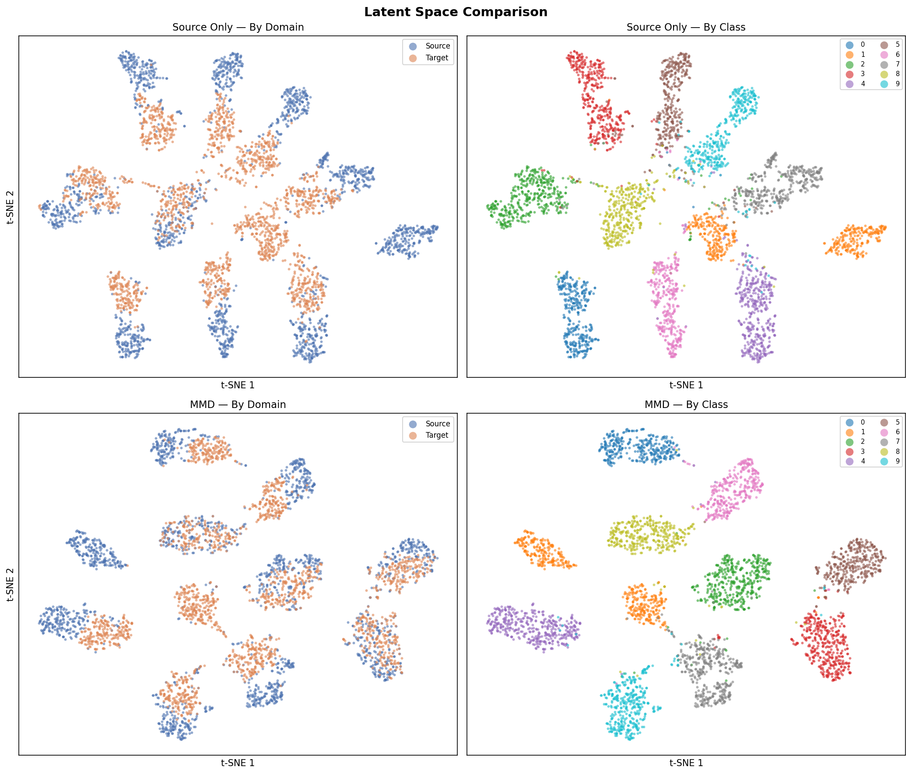
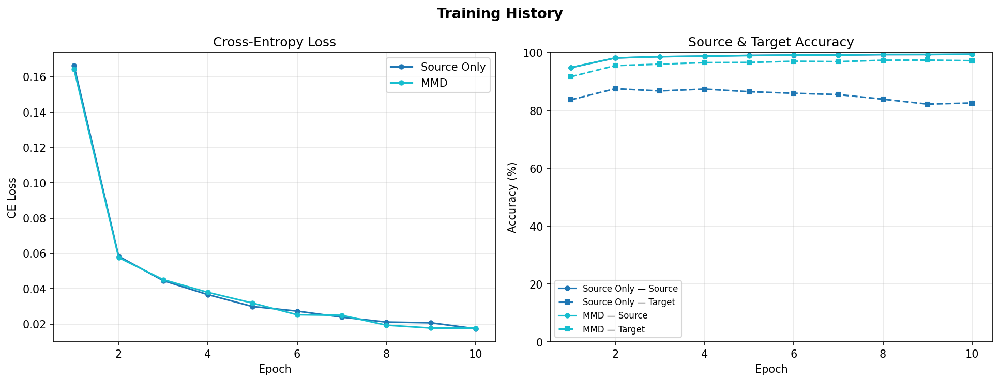
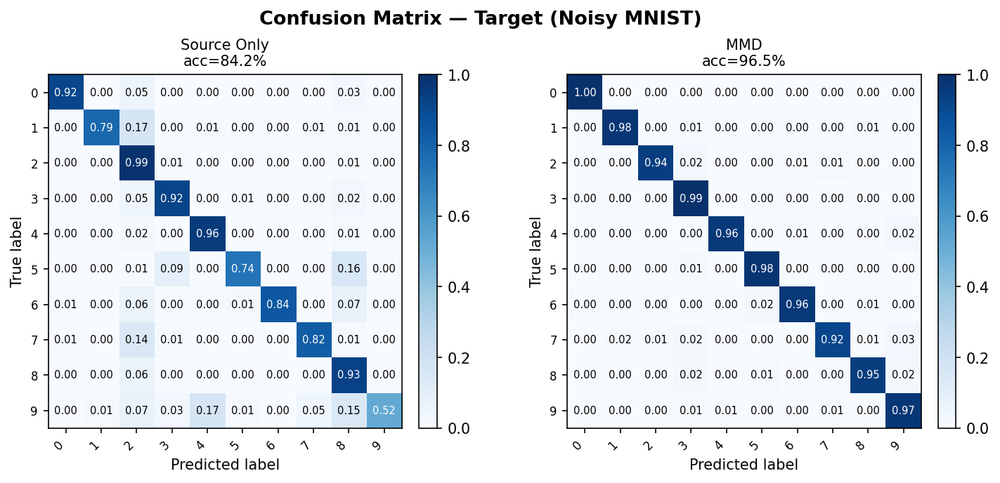
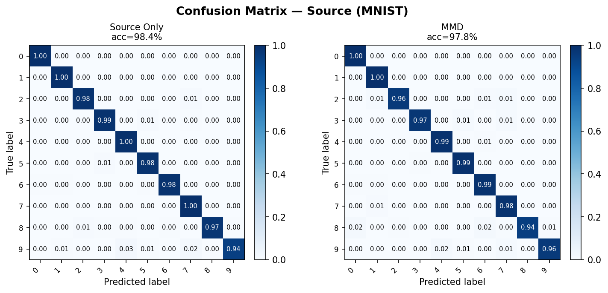
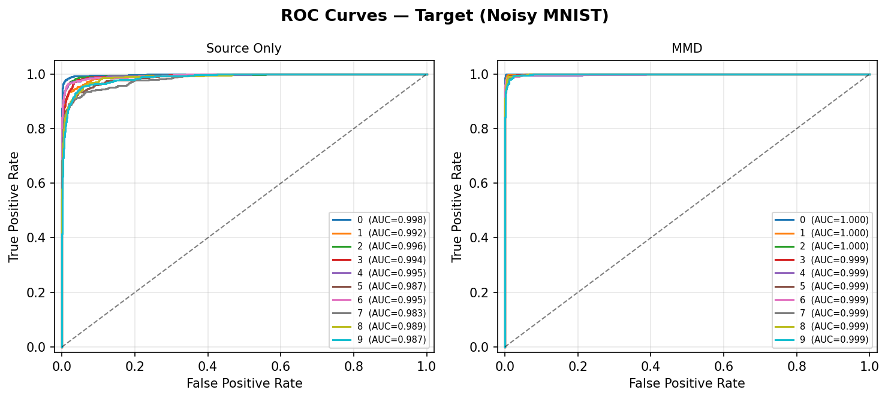
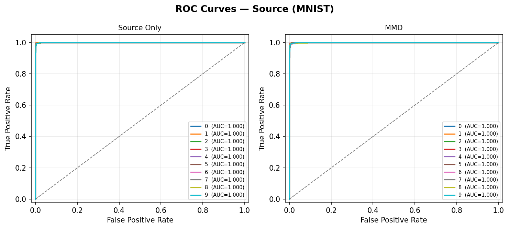

# Diagnostics

`shiftkit.diagnostics` provides visualisation tools for inspecting latent spaces, classification performance, and training dynamics.

---

## plot_latent_space

Encode samples from source and target loaders, project to 2-D, and plot two panels:

- **Left** — coloured by domain (source = blue, target = orange)
- **Right** — coloured by class label (10 colours)

Three projection methods are available via the `projection` parameter:
[t-SNE](#t-sne), [Isomap](#isomap), and [UMAP](#umap).

```python
from shiftkit.diagnostics import plot_latent_space

# t-SNE (default)
fig = plot_latent_space(
    model=model,
    source_loader=test_src,
    target_loader=test_tgt,
    max_samples=2000,
    projection="tsne",
    title="CNN + MMD",
    save_path="outputs/latent_space.png",
    show=False,
)

# Isomap
fig = plot_latent_space(model, test_src, test_tgt,
                        projection="isomap", n_neighbors=10)

# UMAP
fig = plot_latent_space(model, test_src, test_tgt,
                        projection="umap", n_neighbors=15, min_dist=0.1)
```

### Parameters

| Parameter | Type | Default | Description |
|-----------|------|---------|-------------|
| `model` | `nn.Module` | — | Trained model with `.encode()` method |
| `source_loader` | `DataLoader` | — | Source domain DataLoader |
| `target_loader` | `DataLoader` | — | Target domain DataLoader |
| `max_samples` | `int` | `2000` | Max samples per domain |
| `projection` | `str` | `"tsne"` | Projection method: `"tsne"`, `"isomap"`, or `"umap"` |
| `perplexity` | `float` | `30.0` | t-SNE perplexity *(t-SNE only)* |
| `n_iter` | `int` | `1000` | t-SNE number of iterations *(t-SNE only)* |
| `n_neighbors` | `int` | `15` | Neighbourhood size *(Isomap and UMAP)* |
| `min_dist` | `float` | `0.1` | Minimum distance between embedded points *(UMAP only)* |
| `title` | `str` | `"Latent Space"` | Figure suptitle |
| `save_path` | `str \| None` | `None` | If set, save figure to this path |
| `class_names` | `list \| None` | `None` | Class label strings; uses integers if `None` |
| `show` | `bool` | `True` | Whether to call `plt.show()` |

**Returns:** `matplotlib.figure.Figure`

!!! tip "Interpreting the domain panel"
    A well-adapted model will show blue and orange points **interleaved** in the domain panel — the encoder has learned to ignore domain-specific variation. A non-adapted model will show two clearly separated clusters.

---

## compare_latent_spaces

Compare latent spaces of **multiple models** in a single figure. Each model gets one row with the same two panels (by domain, by class). Rows appear in dict insertion order.

```python
from shiftkit.diagnostics import compare_latent_spaces

fig = compare_latent_spaces(
    models={
        "Source Only": model_baseline,
        "MMD":         model_mmd,
        "DANN":        model_dann,
    },
    source_loader=test_src,
    target_loader=test_tgt,
    max_samples=2000,
    projection="tsne",          # or "isomap" / "umap"
    save_path="outputs/latent_space_comparison.png",
    show=False,
)
```

**Output:**


*Top row: Source-Only baseline. Bottom row: MMD-adapted model. Left column: by domain, right column: by class label.*

### Parameters

| Parameter | Type | Default | Description |
|-----------|------|---------|-------------|
| `models` | `dict[str, nn.Module]` | — | `{label: model}` mapping — one row per entry |
| `source_loader` | `DataLoader` | — | Source domain DataLoader |
| `target_loader` | `DataLoader` | — | Target domain DataLoader |
| `max_samples` | `int` | `2000` | Max samples per domain per model |
| `projection` | `str` | `"tsne"` | Projection method: `"tsne"`, `"isomap"`, or `"umap"` |
| `perplexity` | `float` | `30.0` | t-SNE perplexity *(t-SNE only)* |
| `n_iter` | `int` | `1000` | t-SNE iterations *(t-SNE only)* |
| `n_neighbors` | `int` | `15` | Neighbourhood size *(Isomap and UMAP)* |
| `min_dist` | `float` | `0.1` | Minimum distance between points *(UMAP only)* |
| `save_path` | `str \| None` | `None` | If set, save figure to this path |
| `class_names` | `list \| None` | `None` | Class label strings; uses integers if `None` |
| `show` | `bool` | `True` | Whether to call `plt.show()` |

**Returns:** `matplotlib.figure.Figure`

---

## Projection methods

### t-SNE

**t-Distributed Stochastic Neighbour Embedding** converts high-dimensional
similarities into a probability distribution and minimises the KL divergence
between this distribution and one over the 2-D embedding. It excels at revealing
tight clusters but does not preserve global structure, and distances between
clusters are not directly interpretable.

Key hyperparameter: `perplexity` (5–50). Higher values consider larger
neighbourhoods and produce coarser cluster structure.

> **Reference:** van der Maaten, L., & Hinton, G. (2008).
> Visualizing Data using t-SNE.
> *Journal of Machine Learning Research*, 9, 2579–2605.
> [[PDF]](https://www.jmlr.org/papers/volume9/vandermaaten08a/vandermaaten08a.pdf)

---

### Isomap

**Isometric Mapping** extends classical MDS by replacing Euclidean distances
with shortest-path (geodesic) distances on the data manifold, estimated from a
k-nearest-neighbour graph. Unlike t-SNE, Isomap is deterministic and better
preserves **global geometry**, making relative distances between clusters more
meaningful.

Key hyperparameter: `n_neighbors` — the neighbourhood size for the graph. Smaller values
capture fine local structure; larger values smooth the manifold estimate.

> **Reference:** Tenenbaum, J. B., de Silva, V., & Langford, J. C. (2000).
> A Global Geometric Framework for Nonlinear Dimensionality Reduction.
> *Science*, 290(5500), 2319–2323.
> [[PDF]](https://www.robots.ox.ac.uk/~az/lectures/ml/tenenbaum-isomap-Science2000.pdf)

---

### UMAP

**Uniform Manifold Approximation and Projection** constructs a fuzzy topological
representation of the data and optimises a low-dimensional embedding to have a
similar topological structure. It is significantly **faster** than t-SNE on large
datasets and better preserves **both local and global structure**.

Key hyperparameters:

- `n_neighbors` — controls the balance between local and global structure. Smaller values focus on local neighbourhood; larger values give a more global view.
- `min_dist` — minimum distance between embedded points. Smaller values pack clusters more tightly; larger values spread them out.

!!! note "UMAP requires an optional dependency"
    ```bash
    pip install umap-learn
    ```

> **Reference:** McInnes, L., Healy, J., & Melville, J. (2018).
> UMAP: Uniform Manifold Approximation and Projection for Dimension Reduction.
> *arXiv:1802.03426*.
> [[PDF]](https://arxiv.org/pdf/1802.03426)

---

## plot_training_history

Plot CE loss and accuracy curves from one or more training histories on the same axes.

- **Left panel** — cross-entropy loss per model
- **Right panel** — source accuracy (solid) and target accuracy (dashed) per model

```python
from shiftkit.diagnostics import plot_training_history

# Single history (backward-compatible)
plot_training_history(history_mmd)

# Multi-model comparison
fig = plot_training_history(
    histories={
        "Source Only": history_baseline,
        "MMD":         history_mmd,
        "DANN":        history_dann,
    },
    save_path="outputs/training_history.png",
    show=False,
)
```

**Output:**


*Left: CE loss for both models. Right: source accuracy (solid) and target accuracy (dashed). The gap between solid and dashed lines shows the domain shift.*

### Parameters

| Parameter | Type | Default | Description |
|-----------|------|---------|-------------|
| `histories` | `list \| dict[str, list]` | — | Single history list, or `{label: history}` dict for multi-model overlay |
| `save_path` | `str \| None` | `None` | If set, save figure to this path |
| `show` | `bool` | `True` | Whether to call `plt.show()` |

**Returns:** `matplotlib.figure.Figure`

### History dict format

Each history is a `list[dict]` returned by `trainer.fit()`. Required keys:

| Key | Type | Description |
|-----|------|-------------|
| `epoch` | `int` | Epoch number |
| `ce_loss` | `float` | Cross-entropy loss |
| `mmd_loss` | `float` | MMD² loss (`0.0` for `SourceOnlyTrainer`) |
| `total_loss` | `float` | Total loss |
| `src_acc` | `float` | Source accuracy in `[0, 1]` |
| `tgt_acc` | `float` | Target accuracy in `[0, 1]` |

---

## plot_confusion_matrix

Compute and display a **normalised confusion matrix** (row = true class, column = predicted class) for one or more models on a single DataLoader. Each cell shows the proportion of true-class samples predicted as each class — perfect classification gives an identity matrix.

Accepts a single model or a `{label: model}` dict to compare multiple models side-by-side in one figure.

```python
from shiftkit.diagnostics import plot_confusion_matrix

# Single model on target test set
fig = plot_confusion_matrix(
    models=model_mmd,
    loader=test_tgt,
    domain="target-test",
    save_path="outputs/confusion_matrix.png",
    show=False,
)

# Compare multiple models side-by-side
fig = plot_confusion_matrix(
    models={
        "Source Only": model_baseline,
        "MMD":         model_mmd,
        "LMMD":        model_lmmd,
    },
    loader=test_tgt,
    class_names=[str(i) for i in range(10)],
    domain="target-test",
    save_path="outputs/confusion_matrix_comparison.png",
    show=False,
)
```

### Parameters

| Parameter | Type | Default | Description |
|-----------|------|---------|-------------|
| `models` | `nn.Module \| dict[str, nn.Module]` | — | Single model or `{label: model}` dict |
| `loader` | `DataLoader` | — | Labelled DataLoader to evaluate on |
| `class_names` | `list[str] \| None` | `None` | Class label strings; uses integers if `None` |
| `max_samples` | `int` | `5000` | Maximum number of samples to evaluate |
| `normalize` | `bool` | `True` | Row-normalise to proportions; if `False` show raw counts |
| `domain` | `str` | `"target"` | Label shown in the figure title |
| `save_path` | `str \| None` | `None` | If set, save figure to this path |
| `show` | `bool` | `True` | Whether to call `plt.show()` |

**Returns:** `matplotlib.figure.Figure`

**Target domain output (Source-Only vs MMD):**


*Row-normalised confusion matrices on the Noisy MNIST target test set. Source-Only (left) shows visible off-diagonal errors due to domain shift; MMD (right) recovers a near-diagonal structure.*

**Source domain output (reference):**


*Same models evaluated on the clean MNIST source test set — both models perform similarly here, confirming the performance gap is domain-induced.*

!!! tip "Interpreting the confusion matrix"
    - **Diagonal cells** (top-left to bottom-right) show correct predictions for each class.
    - **Off-diagonal cells** reveal which classes are confused with each other.
    - After DA, a well-adapted model should show a near-diagonal matrix on the target domain that closely matches its source-domain matrix.

---

## plot_roc_curve

Plot **per-class ROC curves with AUC scores** using a one-vs-rest (OvR) strategy.

- For **binary** tasks: a single ROC curve is drawn.
- For **multi-class** tasks: one curve per class, all on the same axes per model.

Accepts a single model or a `{label: model}` dict to compare models side-by-side.

```python
from shiftkit.diagnostics import plot_roc_curve

# Single model
fig = plot_roc_curve(
    models=model_mmd,
    loader=test_tgt,
    domain="target-test",
    save_path="outputs/roc_curves.png",
    show=False,
)

# Compare multiple models
fig = plot_roc_curve(
    models={
        "Source Only": model_baseline,
        "MMD":         model_mmd,
        "LMMD":        model_lmmd,
    },
    loader=test_tgt,
    class_names=[str(i) for i in range(10)],
    domain="target-test",
    save_path="outputs/roc_comparison.png",
    show=False,
)
```

### Parameters

| Parameter | Type | Default | Description |
|-----------|------|---------|-------------|
| `models` | `nn.Module \| dict[str, nn.Module]` | — | Single model or `{label: model}` dict |
| `loader` | `DataLoader` | — | Labelled DataLoader to evaluate on |
| `class_names` | `list[str] \| None` | `None` | Class label strings; uses integers if `None` |
| `max_samples` | `int` | `5000` | Maximum number of samples to evaluate |
| `domain` | `str` | `"target"` | Label shown in the figure title |
| `save_path` | `str \| None` | `None` | If set, save figure to this path |
| `show` | `bool` | `True` | Whether to call `plt.show()` |

**Returns:** `matplotlib.figure.Figure`

### How ROC and AUC work

The **ROC curve** plots the True Positive Rate (recall) against the False Positive Rate as the classification threshold varies. For multi-class problems each class c is treated as the positive class and all others as negative (one-vs-rest).

$$\text{TPR} = \frac{TP}{TP + FN}, \qquad \text{FPR} = \frac{FP}{FP + TN}$$

The **Area Under the Curve (AUC)** summarises the entire ROC curve as a single number:

- **AUC = 1.0** — perfect classifier
- **AUC = 0.5** — random chance (diagonal dashed line)
- **AUC < 0.5** — worse than random (predictions are systematically inverted)

**Target domain output (Source-Only vs MMD):**


*Per-class ROC curves on the Noisy MNIST target test set. Source-Only (left) shows lower AUC for several classes due to domain shift; MMD (right) restores near-perfect AUC across all 10 digits.*

**Source domain output (reference):**


*Same models on the clean MNIST source test set — both models show high AUC on source, confirming the drop on target is domain-induced rather than a training failure.*

!!! tip "AUC as a DA quality metric"
    Compare AUC on the **target test set** across methods. An improvement over the Source-Only baseline directly quantifies the benefit of domain adaptation for each class, independent of the classification threshold.
