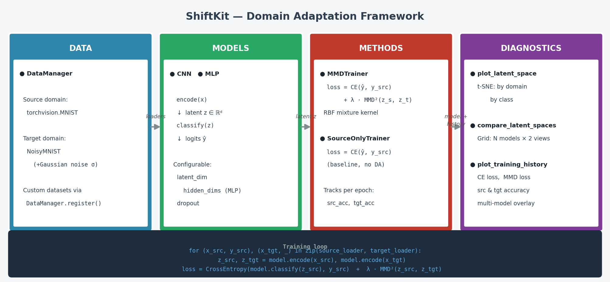

# ShiftKit

A lightweight, modular **domain adaptation framework** for PyTorch — transfer knowledge from a labelled *source* domain to an unlabelled *target* domain using deep latent space alignment.



---

## Quick start

```python
from shiftkit.data        import DataManager
from shiftkit.models      import CNN
from shiftkit.methods     import MMDTrainer, SourceOnlyTrainer
from shiftkit.diagnostics import compare_latent_spaces, plot_training_history

# 1. Load source and target data
dm = DataManager(batch_size=128)
train_src, train_tgt = dm.load("mnist_noisy_mnist", train=True)
test_src,  test_tgt  = dm.load("mnist_noisy_mnist", train=False)

# 2. Choose a model
model_baseline = CNN(latent_dim=128, num_classes=10)
model_mmd      = CNN(latent_dim=128, num_classes=10)

# 3. Train — baseline vs MMD domain adaptation
baseline = SourceOnlyTrainer(model_baseline, train_src, train_tgt)
mmd      = MMDTrainer(model_mmd, train_src, train_tgt, mmd_weight=1.0)

history_baseline = baseline.fit(epochs=10)
history_mmd      = mmd.fit(epochs=10)

# 4. Visualise results
plot_training_history({"Source Only": history_baseline, "MMD": history_mmd})
compare_latent_spaces({"Source Only": model_baseline, "MMD": model_mmd},
                      test_src, test_tgt)
```

---

## Installation

```bash
git clone https://github.com/AleksCipri/ShiftKit.git
cd ShiftKit
pip install -r requirements.txt
```

---

## Modules

| Module | Key classes / functions | Description |
|--------|------------------------|-------------|
| [`shiftkit.data`](data.md) | `DataManager`, `NoisyMNIST` | Dataset loading and registration |
| [`shiftkit.models`](models.md) | `CNN`, `MLP` | Neural network architectures with `encode` / `classify` split |
| [`shiftkit.methods`](methods.md) | `MMDTrainer`, `SourceOnlyTrainer`, `MMDLoss` | Domain adaptation training loops |
| [`shiftkit.diagnostics`](diagnostics.md) | `plot_latent_space`, `compare_latent_spaces`, `plot_training_history` | Latent space and training visualisations |

---

## Example outputs

Run the built-in MNIST → Noisy MNIST experiment:

```bash
python examples/mnist_mmd.py
```

=== "Training history"
    
    *CE loss, MMD loss, and source/target accuracy for both models over 10 epochs.*

=== "Latent space comparison"
    
    *t-SNE projections of the latent space, coloured by domain (left) and class (right).
    Top row: Source-Only baseline. Bottom row: MMD-adapted model.*

---

## Design principles

- **Encoder / classifier split** — all models expose `.encode(x)` and `.classify(z)` so DA methods can operate directly in latent space without touching the classifier head.
- **Shared history format** — `SourceOnlyTrainer` and `MMDTrainer` return identically structured history dicts, so plotting and comparison functions work on either.
- **Extensible registry** — new dataset pairs can be registered at runtime via `DataManager.register()` without modifying the library.
