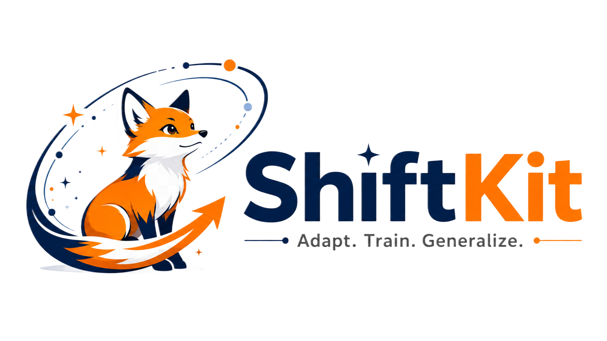
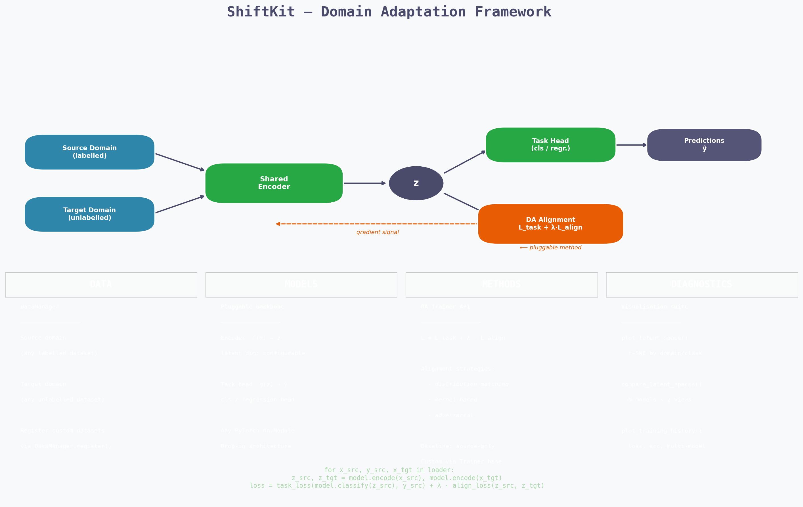

<p align="center">
  
</p>

A lightweight, modular **domain adaptation** framework for PyTorch. Transfer knowledge from a labelled *source* domain to an unlabelled *target* domain using deep latent-space alignment.



---

## Installation

```bash
git clone https://github.com/AleksCipri/ShiftKit.git
cd ShiftKit
pip install -r requirements.txt
```

**Dependencies:** `torch`, `torchvision`, `numpy`, `matplotlib`, `scikit-learn`, `tqdm`

---

## Quick start

```python
from shiftkit.data        import DataManager
from shiftkit.models      import CNN
from shiftkit.methods     import MMDTrainer, SourceOnlyTrainer
from shiftkit.diagnostics import compare_latent_spaces, plot_training_history

# 1. Load data
dm = DataManager(batch_size=128)
train_src, train_tgt = dm.load("mnist_noisy_mnist", train=True)
test_src,  test_tgt  = dm.load("mnist_noisy_mnist", train=False)

# 2. Build models
model_baseline = CNN(latent_dim=128, num_classes=10)
model_mmd      = CNN(latent_dim=128, num_classes=10)

# 3. Train — baseline vs MMD domain adaptation
baseline = SourceOnlyTrainer(model_baseline, train_src, train_tgt)
mmd      = MMDTrainer(model_mmd, train_src, train_tgt, mmd_weight=1.0)

history_baseline = baseline.fit(epochs=10)
history_mmd      = mmd.fit(epochs=10)

# 4. Visualise
plot_training_history({"Source Only": history_baseline, "MMD": history_mmd})
compare_latent_spaces({"Source Only": model_baseline, "MMD": model_mmd},
                      test_src, test_tgt)
```
